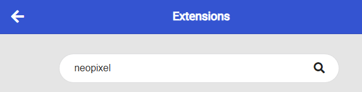
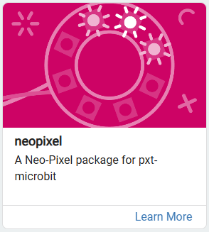
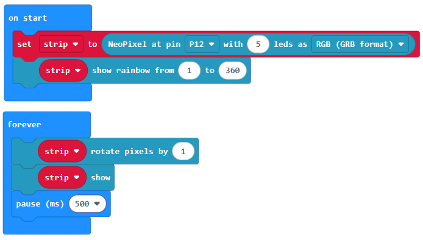
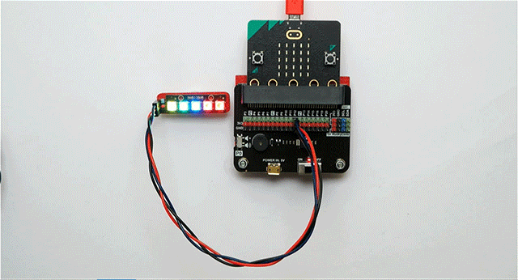

.v["title"] = "Reference - Neopixel - Think Create Learn" .v["heading1"] = "Neopixel Strip" .v["heading2"] = "Neopixels come as strips of LEDs. Each LED can be individually set to a different colour." .v["intro"] = "

Use a neopixel to make a colourful light show, visualise some data and much more!

Wiring

Use a GVS cable to connect the neopixel. This has 3 wires, blue, red and black:

Wire up as follows, using the Edge Connector or Motor Controller board:

Neopixel	Microbit
3-pin connector	P12 3-pin connecto

Make sure you connect the cable the right way round, with the black wire connecting to the black pin on both ends.

On the edge connector it should look like this:

You don't have to use pin P12. You can use any digital pin. Just remember to adjust your code accordingly.

Coding
You will need to add an extension to get additional blocks for the neopixel. Click on the extensions block:

Then search for "neopixel":

Then click on the neopixel extension:

You should see a new block appear:

Enter this code in on start and forever blocks:

Download the code to the microbit.

The on start block sets up a strip of 5 neopixels and shows a rainbow of colours on each one. The forever block then rotates the pixels, so they move around the strip every 1/2 second.

The values in the show rainbow block relate to the range of colours, or hue, to show. This relates to the HSL (Hue Saturation Lightness) model for defining colours. Take a look at this link to see how these 3 values can be changed to select different colours:

[HSL Colours](https://www.w3schools.com/colors/colors_hsl.asp)

.navBack("BitMakeLab main page")